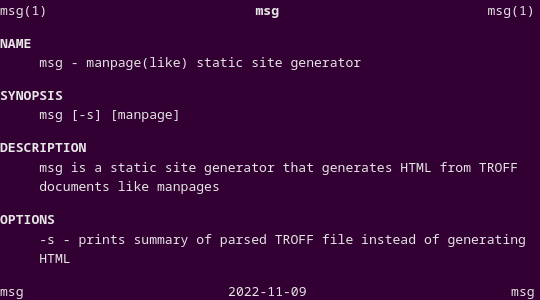

# MSG - Mangpage(like) static Site Generator

Project that turns mangpage like documents into static HTML sites.



## Usage

```
$ cc -o msg msg.c
$ ./msg something.1 > something.html
```

## See also

- [Website that inspired this project](http://apgwoz.com/)
- [CSS library that inspired theming](https://github.com/Xe/xess)
- [Tsoding String_View library that is used in this project](https://github.com/tsoding/sv)
